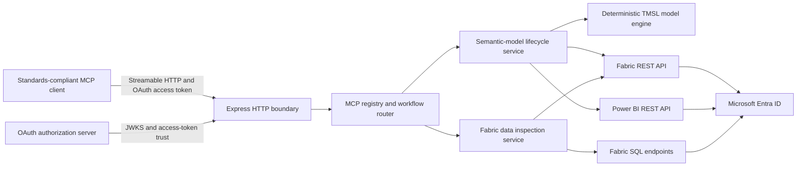

# Fabric Semantic Model MCP Server

Production Model Context Protocol (MCP) server for creating, inspecting, updating, querying,
refreshing, and permanently deleting Microsoft Fabric semantic models. The service also exposes
read-only Lakehouse and Warehouse discovery, schema inspection, and bounded table sampling so an
AI agent can understand source data before constructing a model.

The application is a stateless TypeScript service designed for Linux containers and compatible
with standards-compliant MCP clients over Streamable HTTP. MCP client authentication is independent
from the Microsoft Entra identity used to call Fabric: production deployments use OAuth protected-
resource discovery, while a static bearer key remains available for controlled private testing.

## Capabilities

- Streamable HTTP MCP transport at `POST /mcp`.
- Health and readiness probes at `GET /health` and `GET /ready`.
- OAuth protected-resource discovery, JWT validation through remote JWKS, optional private API-key
  authentication, host/origin validation, and secret-safe structured logging.
- Runtime workspace discovery governed by Entra and Fabric permissions; no workspace ID is stored
  in application configuration.
- Semantic-model creation, property updates, definition reads, atomic object CRUD, connection
  binding, DAX validation and execution, refresh management, snapshots, diffs, and deployment
  validation.
- Deterministic TMSL encoding, semantic validation, dependency checks, stable SHA-256 hashes, and
  optimistic concurrency protection.
- Preview-first mutations and strong permanent-delete confirmation.
- Fabric Lakehouse and Warehouse discovery through Fabric REST APIs.
- Read-only SQL endpoint metadata inspection and bounded table sampling without exposing arbitrary
  SQL execution.
- Bounded HTTP retries, timeouts, pagination, long-running-operation polling, row counts, and
  response sizes.
- Reproducible multi-stage container build running as an unprivileged user.

## Architecture



The HTTP boundary authenticates every MCP request before invoking a tool. This client-facing OAuth
boundary is separate from the server's Entra credential, which authenticates outbound Fabric,
Power BI, and SQL calls. The workflow layer applies safety policies and delegates to typed services.
Microsoft remains authoritative for workspace, item, model, and SQL authorization. The process
writes no credentials, model state, or query results to local storage.

### Repository layout

| Path                    | Purpose                                                                           |
| ----------------------- | --------------------------------------------------------------------------------- |
| `src/clients`           | Entra-authenticated Fabric, Power BI, and Fabric SQL clients                      |
| `src/http`              | Express application, probes, request security, and MCP transport                  |
| `src/mcp`               | Published tools, resources, schemas, and server integration                       |
| `src/model`             | TMSL codec, model schemas, validation, DAX analysis, hashing, and mutation engine |
| `src/services`          | Semantic-model and data-inspection workflow orchestration                         |
| `scripts`               | Container and explicitly authorized live verification utilities                   |
| `tests`                 | Contract, unit, integration, end-to-end, and golden-fixture tests                 |
| `docs/adr`              | Current architectural decisions and constraints                                   |
| `docs/deployment.md`    | Render and Azure deployment and rollback runbook                                  |
| `docs/test-evidence.md` | Verified production release evidence                                              |

## Prerequisites

### Build and runtime

- Node.js `24.14.0`
- npm `11.9.0`
- Docker with Linux-container support for image verification and container deployment
- Network access to Microsoft Entra, Fabric, and Power BI over HTTPS
- Outbound TCP `1433` to `*.datawarehouse.fabric.microsoft.com` when SQL schema inspection or table
  sampling is required

The Node.js version is pinned in `.node-version`, `.nvmrc`, and the Dockerfile. Application and
development dependencies are locked in `package-lock.json`.

### Microsoft tenant and workspace

1. Register a Microsoft Entra application or configure an Azure managed identity.
2. Enable the Fabric tenant setting that permits service principals to use Fabric APIs.
3. Add the identity directly to each required Fabric workspace. Use Viewer/Read permissions for
   discovery-only scenarios and Contributor or higher only where model mutations are approved.
4. Grant the identity access to each Lakehouse SQL analytics endpoint or Warehouse that it must
   inspect.
5. Enable the Power BI tenant setting for Dataset Execute Queries REST API when DAX execution is
   required, and grant the identity semantic-model Read and Build permissions.

Access to a workspace is effective as soon as Fabric returns it to the configured identity. No
application redeployment or workspace configuration change is required.

## Installation and local execution

Install the locked dependencies and create a local configuration file:

```powershell
npm ci
Copy-Item .env.example .env
```

For local testing, leave `MCP_AUTH_MODE=api-key`, populate a strong `MCP_API_KEY`, and set the
appropriate Entra settings. The application does not automatically read `.env`; use a secret-aware
process manager or Node's environment-file option:

```powershell
npm run build
node --env-file=.env dist/index.js
```

For watch mode, export the required variables into the shell or IDE process environment before
running:

```powershell
npm run dev
```

The default local endpoint is `http://localhost:3000/mcp`. In API-key mode, requests require:

```text
Authorization: Bearer <MCP_API_KEY>
```

## Configuration

All production configuration is supplied at runtime. Never commit `.env`, credentials, access
tokens, Fabric item IDs, or workspace IDs.

| Variable                    |    Required | Default       | Description                                                                                            |
| --------------------------- | ----------: | ------------- | ------------------------------------------------------------------------------------------------------ |
| `MCP_AUTH_MODE`             |          No | `api-key`     | MCP client authentication: `api-key` for private use or `oauth` for standards-based remote deployment. |
| `MCP_API_KEY`               | Conditional | None          | Bearer secret of at least 32 characters; required only in `api-key` mode.                              |
| `MCP_PUBLIC_BASE_URL`       |       OAuth | None          | Canonical public HTTPS origin, without a path. The server derives `/mcp` and discovery URLs from it.   |
| `MCP_OAUTH_ISSUER_URL`      |       OAuth | None          | Issuer identifier for the external OAuth authorization server.                                         |
| `MCP_OAUTH_JWKS_URL`        |       OAuth | None          | HTTPS JWKS endpoint used to verify access-token signatures.                                            |
| `MCP_OAUTH_AUDIENCE`        |       OAuth | None          | Required access-token audience for this MCP resource server.                                           |
| `MCP_OAUTH_REQUIRED_SCOPES` |       OAuth | None          | Comma-separated scopes every MCP access token must grant.                                              |
| `NODE_ENV`                  |          No | `development` | Runtime mode: `development`, `test`, or `production`.                                                  |
| `HOST`                      |          No | `0.0.0.0`     | HTTP bind host.                                                                                        |
| `PORT`                      |          No | `3000`        | HTTP listening port; hosting platforms may inject this value.                                          |
| `MCP_ALLOWED_HOSTS`         |          No | Local hosts   | Comma-separated hostnames without schemes or ports.                                                    |
| `MCP_ALLOWED_ORIGINS`       |          No | Allowed hosts | Comma-separated browser Origin hostnames without schemes or ports.                                     |
| `LOG_LEVEL`                 |          No | `info`        | `debug`, `info`, `warn`, or `error`.                                                                   |
| `AZURE_AUTH_MODE`           |          No | `auto`        | `client-secret`, `default`, or `auto`. `auto` selects client-secret mode when a client secret exists.  |
| `AZURE_TENANT_ID`           | Conditional | None          | Tenant UUID for client-secret authentication.                                                          |
| `AZURE_CLIENT_ID`           | Conditional | None          | Application UUID, or user-assigned managed-identity client UUID.                                       |
| `AZURE_CLIENT_SECRET`       | Conditional | None          | Required in client-secret mode. Store only as a platform secret.                                       |
| `POWERBI_MCP_READONLY`      |          No | `true`        | Blocks applied create, update, delete, bind, and refresh operations when `true`.                       |
| `HTTP_TIMEOUT_MS`           |          No | `30000`       | Per-attempt Microsoft API and SQL timeout.                                                             |
| `HTTP_MAX_RETRIES`          |          No | `2`           | Retry count for operations explicitly classified as safe.                                              |
| `HTTP_MAX_PAGES`            |          No | `100`         | Maximum Microsoft API pages followed by one request.                                                   |
| `HTTP_MAX_RESPONSE_BYTES`   |          No | `10485760`    | Maximum Microsoft API response body size.                                                              |
| `LRO_POLL_BUDGET_MS`        |          No | `60000`       | Maximum synchronous Fabric long-running-operation polling time.                                        |
| `DAX_MAX_ROWS`              |          No | `1000`        | Maximum DAX rows returned by the server.                                                               |
| `DAX_MAX_RESPONSE_BYTES`    |          No | `1048576`     | Maximum serialized DAX response size.                                                                  |
| `DATA_MAX_ROWS`             |          No | `100`         | Maximum Lakehouse/Warehouse sample rows returned by the server.                                        |
| `DATA_MAX_RESPONSE_BYTES`   |          No | `1048576`     | Maximum serialized data-inspection response size.                                                      |

Configuration is validated before the server binds a port. Validation messages identify invalid
variable names without returning their values.

## MCP interface

The server publishes 25 tools. Input schemas, read/write classifications, and safety annotations
are defined centrally in `src/mcp/registry.ts` and protected by contract tests.

### Client authentication and interoperability

`MCP_AUTH_MODE=oauth` is the production mode for remote MCP clients. It publishes RFC 9728
protected-resource metadata at both of the MCP discovery locations below and includes the
path-specific metadata URL in unauthenticated `WWW-Authenticate` responses:

```text
GET /.well-known/oauth-protected-resource
GET /.well-known/oauth-protected-resource/mcp
```

The configured authorization server must publish OAuth authorization-server metadata, support
authorization-code flow with S256 PKCE, issue JWT access tokens for `MCP_OAUTH_AUDIENCE`, and expose
the configured JWKS endpoint. For broad client interoperability, it must also support an MCP client
registration method such as pre-registration or Client ID Metadata Documents. These provider
capabilities are external to this resource server.

The server validates the JWT signature, algorithm, issuer, audience, lifetime, and required scopes
before MCP processing. It accepts standard `scope` claims and Microsoft-compatible `scp` claims.
`MCP_AUTH_MODE=api-key` intentionally remains available for local checks and private integrations,
but static bearer keys do not provide interoperable OAuth authorization for public MCP clients.

Do not expose `AZURE_CLIENT_SECRET` to MCP clients. The `AZURE_*` identity is the server's outbound
Fabric identity, not an MCP OAuth client credential. If Microsoft Entra is also selected as the MCP
authorization server, configure a separately exposed API audience and delegated scope and
pre-register every client that requires it. Environments requiring dynamic MCP client onboarding
should use an authorization server or identity gateway that advertises the corresponding MCP client
registration capability and can federate to the organization's identity provider.

The implementation uses the official MCP TypeScript SDK and negotiates supported protocol versions
through the Streamable HTTP transport. Any client must itself support the negotiated MCP protocol,
Streamable HTTP, and the configured authorization-server flow.

### Discovery and source inspection

- `list_workspaces`
- `list_semantic_models`
- `list_lakehouses`
- `get_lakehouse`
- `list_lakehouse_tables`
- `list_warehouses`
- `get_warehouse`
- `inspect_data_source_schema`
- `sample_data_source_table`

### Semantic-model lifecycle

- `get_semantic_model`
- `get_semantic_model_definition`
- `get_model_info`
- `create_semantic_model`
- `update_semantic_model_properties`
- `apply_model_changes`
- `delete_semantic_model`
- `bind_semantic_model_connection`

### DAX, refresh, and asynchronous operations

- `validate_dax`
- `execute_dax`
- `refresh_semantic_model`
- `get_refresh_status`
- `get_operation_status`

### Analysis and deployment validation

- `model_snapshot`
- `model_diff`
- `pre_deploy_gate`

Every tool returns a consistent result envelope:

```json
{
  "ok": true,
  "status": "success",
  "message": "Semantic models listed.",
  "data": { "value": [] },
  "error": null
}
```

The server also publishes `fabric://reference/capabilities` and `fabric://reference/safety` as
read-only MCP resources.

## Safe operating model

1. Keep `POWERBI_MCP_READONLY=true` during deployment validation and source discovery.
2. Use `list_workspaces` to discover only workspaces visible to the configured identity.
3. Inspect Lakehouse/Warehouse metadata and bounded samples before preparing a model definition.
4. Preview every semantic-model mutation before setting `apply: true`.
5. Supply the current definition hash for model object changes. A stale hash fails before write.
6. Treat deletion as irreversible. Applied deletion requires the model ID twice, the exact current
   display name, an explicit permanent-delete flag, and `apply: true`.
7. Return to read-only mode whenever mutation access is not actively required.

`sample_data_source_table` accepts only item, schema, table, optional column identifiers, and a row
limit. The server validates and quotes identifiers and constructs a single bounded `SELECT TOP`
statement. MCP callers cannot provide arbitrary T-SQL.

## Verification

Run the complete local quality gate:

```powershell
npm run check
```

This runs formatting checks, ESLint, strict TypeScript compilation, unit/contract/integration/MCP
end-to-end tests with coverage thresholds, and a production build.

Verify the final Linux image:

```powershell
npm run test:container
```

The container gate verifies the pinned runtime, production-only dependencies, non-root execution,
read-only filesystem compatibility, dropped Linux capabilities, probes, authentication, MCP
discovery, restart recovery, secret-free logs, and graceful shutdown.

Credential-backed read-only checks are available after Microsoft configuration is complete:

```powershell
npm run test:live
npm run test:live:data
```

Destructive verification commands operate only on uniquely named disposable models and require an
explicit non-production workspace plus separate mutation and permanent-delete acknowledgements:

| Command                         | Scope                                                 | Required acknowledgements                                                  |
| ------------------------------- | ----------------------------------------------------- | -------------------------------------------------------------------------- |
| `npm run test:live:lifecycle`   | Semantic-model definition and object lifecycle        | `LIVE_LIFECYCLE_MUTATION=true`, `LIVE_LIFECYCLE_PERMANENT_DELETE=true`     |
| `npm run test:live:dax-refresh` | MCP, DAX, snapshot, diff, gate, and refresh workflows | `LIVE_DAX_REFRESH_MUTATION=true`, `LIVE_DAX_REFRESH_PERMANENT_DELETE=true` |
| `npm run test:live:full`        | Complete lifecycle twice with cleanup verification    | `LIVE_FULL_MUTATION=true`, `LIVE_FULL_PERMANENT_DELETE=true`               |

All destructive checks additionally require `FABRIC_TEST_WORKSPACE_ID` and
`POWERBI_MCP_READONLY=false`. Never point these utilities at a production workspace. Cleanup uses
strong permanent-delete confirmation and fails the test if the created item cannot be removed.

The live-test utilities load `.env` for variables that are not already defined. Existing process or
shell environment variables take precedence. Run credential-backed verification from a clean shell,
or explicitly refresh inherited variables after rotating an Entra client secret.

See `docs/test-evidence.md` for the currently verified release results.

## Deployment

The same Docker image is used for Render and Azure Container Apps. Follow
`docs/deployment.md` for the complete deployment, validation, rollback, and identity procedures.

### Render summary

1. Create a Blueprint or Docker web service from `render.yaml`.
2. Set `MCP_PUBLIC_BASE_URL` to the service's public HTTPS origin and configure the OAuth issuer,
   JWKS, audience, and required scopes. No Render URL is present in the application image.
3. Set `AZURE_TENANT_ID`, `AZURE_CLIENT_ID`, and `AZURE_CLIENT_SECRET` as secrets for outbound
   Microsoft API access.
4. Leave `POWERBI_MCP_READONLY=true` for initial validation.
5. Verify `/health`, `/ready`, OAuth discovery, bearer rejection, MCP initialization, and read-only
   Fabric discovery.
6. Enable mutation only after authorization and rollback procedures have been approved.

Do not configure a workspace ID on Render. Fabric workspace membership assigned to the Entra
application is the authorization boundary.

### Azure summary

Use the same image with Azure Container Apps. Change only `MCP_PUBLIC_BASE_URL` when the public
origin changes. Prefer `AZURE_AUTH_MODE=default` and a managed identity instead of a client secret,
and grant Fabric workspace/item permissions directly to that identity.

## Security considerations

- Use least-privilege Fabric workspace and item permissions.
- Keep the service in read-only mode unless approved mutation workflows are required.
- Rotate OAuth signing keys through the authorization server and rotate any API key or Entra secret
  through the hosting platform; restart instances after changing runtime configuration.
- Restrict public ingress, allowed hosts, and browser origins to the intended MCP clients.
- Terminate TLS at the hosting platform. Never expose the service over plaintext public HTTP.
- Do not log or include credentials, access tokens, connection secrets, model definitions, DAX row
  data, or sampled table values in support requests.
- Review dependency and container scan findings before deployment.
- Treat semantic-model deletion as permanent and non-recoverable.

## Operations and maintenance

- Use `/health` for liveness and `/ready` for readiness monitoring.
- Monitor structured logs for error code, Microsoft request ID, operation name, retryability, and
  duration. Normal logs intentionally omit request and response bodies.
- Scale horizontally; the server is stateless and stores no local operation database.
- Preserve client-side operation IDs returned when Fabric polling exceeds the configured budget and
  resume with `get_operation_status`.
- Re-run `npm run check` and `npm run test:container` after every dependency, Node.js, schema, or
  deployment change.
- Validate Microsoft API contract changes against typed response schemas and live read-only checks
  before promotion.
- Roll back by redeploying the last verified immutable image. Configuration rollback is independent
  because all environment settings are runtime supplied.

## Supported model boundary

The service uses the TMSL `model.bim` representation as its canonical semantic-model definition. It
supports structured data-source metadata without credentials; source and calculated columns; M,
query, entity/Direct Lake, calculated, and calculation-group partitions; measures; single-column
relationships; hierarchies; calculation groups and items; named M expressions; and read-only roles
with table filters.

For Direct Lake on OneLake, define a shared named M expression with
`AzureStorage.DataLake("https://onelake.dfs.fabric.microsoft.com/<workspace-id>/<item-id>",
[HierarchicalNavigation=true])` and set each entity partition's `expressionSource` to that expression
name. Entity partitions must not reference a structured TDS data source. Import and DirectQuery
query partitions use `dataSourceName` when structured data-source metadata is required. Include
`schemaName` only for schema-enabled Lakehouses; omit it for Lakehouses whose item properties do not
publish `defaultSchema`.

Definitions containing unsupported or unmapped TMSL fields fail closed before mutation to prevent
lossy full-definition replacement. Desktop-only operations, PBIX extraction, XMLA/TOM/ADOMD, a TMDL
parser, arbitrary SQL execution, and persistent credential storage are outside the service boundary.

Power BI JSON DAX execution is also subject to Microsoft service limitations. Service-principal
queries are not supported by Microsoft for semantic models with RLS or SSO enabled. The service
applies lower configurable response limits and reports partial/truncated results explicitly.

## Additional documentation

- `docs/deployment.md` — deployment, validation, rollback, and platform configuration
- `docs/test-evidence.md` — current automated, container, and live verification evidence
- `docs/adr` — architectural decisions, supported boundaries, and safety rationale
- `THIRD_PARTY_NOTICES.md` — notices for incorporated runtime dependencies

Microsoft API contracts and operational requirements are documented in the
[MCP authorization specification](https://modelcontextprotocol.io/specification/2025-11-25/basic/authorization),
[Fabric REST API overview](https://learn.microsoft.com/en-us/rest/api/fabric/articles/),
[Fabric identity support](https://learn.microsoft.com/en-us/rest/api/fabric/articles/identity-support),
[semantic-model definition contract](https://learn.microsoft.com/en-us/rest/api/fabric/articles/item-management/definitions/semantic-model-definition),
[Lakehouse API documentation](https://learn.microsoft.com/en-us/fabric/data-engineering/lakehouse-api),
and [Power BI Execute Queries documentation](https://learn.microsoft.com/en-us/rest/api/power-bi/datasets/execute-queries-in-group).
